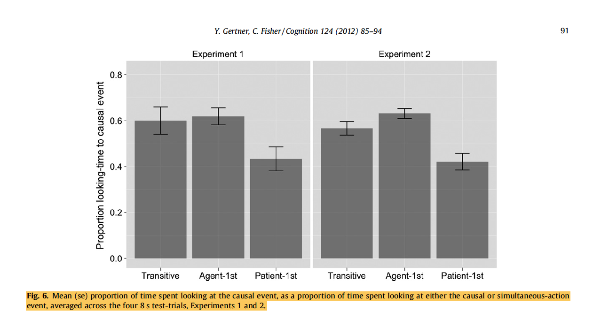

```{r setup, include=FALSE}
library(tidyverse)
library(here)
library(metafor)

source(here("writeups/paper/scripts/prisma_diagram.R"))
source(here("writeups/paper/scripts/model_print.R"))
source(here("writeups/paper/scripts/forest_plot_helper.R"))
source(here("writeups/paper/scripts/funnel_plot_helper.R"))
source(here("writeups/paper/scripts/predictor_plot_helper.R"))
source(here("writeups/paper/scripts/metalab_plot_helper.R"))

ALT_PATH <- here("exploratory_analyses/06_alt_ES/alt_ES.csv")


alt_raw <- read_csv(ALT_PATH) %>% 
  rowid_to_column()
alt_raw
```

# same anlaysis smaller set
```{r}
alt_raw_id <- alt_raw %>% 
  filter(alternative_calc == "between") %>% 
  select(unique_id) %>% 
  pull

all_paper_trans <- read_csv(here("data/processed/syntactic_bootstrapping_tidy_data.csv")) %>% 
  filter(unique_id %in% alt_raw_id) %>% 
  filter(sentence_structure == "transitive")

generate_funnel_plot(all_paper_trans)
```


```{r}
alpha = 0.05

model <- rma.mv(d_calc, 
                  V = d_var_calc,
                  random = ~ 1 | short_cite/same_infant/row_id,
                  method = "REML",
                  data = all_paper_trans)

this_moderator_estimate <- model$b[1]
  this_moderator_SE <- model$se[1]
  this_moderator_estimate.cil <- model$ci.lb[1]
  this_moderator_estimate.cih <- model$ci.ub[1]
  this_moderator_z <- model$zval[1]
  this_moderator_p <- model$pval[1]

abbreviate_label <- function(original_label){
  label_vec <- unlist(strsplit(original_label, ","))
  # get the first label 
  first_author_name <- label_vec[[1]]
  year <- gsub("(-).*","",tail(label_vec, n=1))
  number_label <- gsub(".*-","",tail(label_vec, n=1))
  abbreviated_label <- paste0(first_author_name, " et al.,", year, "-", number_label)
  #print(number_label)
  #print(abbreviated_label)
}

individual_data <- all_paper_trans %>% 
    select(short_cite, unique_id,d_calc,d_var_calc, n_1, plot_label) %>% 
    rowwise() %>% 
    mutate(cil = d_calc - qnorm(alpha / 2, lower.tail = FALSE) * sqrt(d_var_calc),
           cil = case_when(
             (cil < -8) ~ -8, # truncate error bar for visibility reason 
             TRUE ~ cil
           ),
           ciu = d_calc +
             qnorm(alpha / 2, lower.tail = FALSE) * sqrt(d_var_calc), 
           ciu = case_when(
             (ciu > 3 ) ~ 3, # truncate error bar for visibility reason 
             TRUE ~ ciu
           ),
           sentence_structure = "individual",
           meta = "no", 
           label_color = "black",
           print_full = paste(round(d_calc,2), " [",round(cil,2),", ",round(ciu,2), "]", sep = ""),
           plot_label = case_when(
             str_count(plot_label,",") >= 4 ~ abbreviate_label(plot_label),
             TRUE ~ plot_label
           )
)

cumulative_data <- tibble_row(
  short_cite = "Meta-Analytic Effect Size",
           plot_label = "Meta-Analytic Effect Size",
           d_calc = this_moderator_estimate, 
           d_var_calc = NA, 
           n_1 = 99, 
           expt_num = "", 
           expt_condition = "",
           cil = this_moderator_estimate.cil, 
           ciu = this_moderator_estimate.cih, 
           sentence_structure = "cumulative",
           print_full = paste(round(d_calc,2), " [",round(cil,2),", ",round(ciu,2), "]", sep = ""), 
  meta = "yes", 
           label_color = "red"
)

forest_data_all_trans <- bind_rows(individual_data, cumulative_data)

```

```{r}
  forest_data_all_trans$sentence_structure <- as.factor(forest_data_all_trans$sentence_structure)
  forest_data_all_trans$meta <- as.factor(forest_data_all_trans$meta)
  forest_data_all_trans <- forest_data_all_trans %>% 
    rowid_to_column() %>% 
    mutate(
      rowid = if_else(rowid == 0, 99, as.double(rowid)) #to always put the MA ES at bottom
    )  %>% 
    group_by(sentence_structure) %>% arrange(-rowid, .by_group = TRUE)
  forest_data_all_trans$plot_label <- factor(forest_data_all_trans$plot_label, levels = forest_data_all_trans$plot_label)
  
  
  mm_to_point = 18/6.5
  label_size = 5
  x_axis_title <- expression(paste("Cohen\'s ", italic('d')))
  
  # set the neighbourhood levels in the order the occur in the data frame
  label_colors <- forest_data_all_trans$label_color[order(forest_data_all_trans$plot_label)]
  
  forest_data_all_trans %>%  # First sort by val. This sort the dataframe but NOT the factor levels
    ggplot(aes(x = plot_label, y = d_calc)) + 
    geom_hline(aes(yintercept = 0),  color = "gray44",linetype = 2, size =.3) + 
    geom_hline(aes(yintercept = filter(forest_data_all_trans, sentence_structure == "cumulative")$d_calc), 
               color = "red", linetype = 2, size = .3) + 
    geom_point(data = forest_data_all_trans,
               aes(size=(n_1/100), shape = sentence_structure, color = sentence_structure)) + 
    scale_color_manual(breaks = c("cumulative", "individual"),
                       values = c("red", "black"))+ 
    scale_size(guide = 'none', range = c(0.3,3)) + 
    scale_shape_manual(breaks = c("cumulative", "individual"),
                       values=c(18,16, 17)) +
    guides(colour = guide_legend(override.aes = list(size=3))) + 
    geom_linerange(aes(ymin = cil, ymax = ciu, color = sentence_structure), show.legend = FALSE) + 
    geom_segment(aes(x = plot_label, y = d_calc, xend = plot_label, yend = ciu),
                 linejoin = "round", 
                 lineend = "round", 
                 size = 0.2,
                 arrow = arrow(length = unit(0.02, "inches")),
                 data = filter(forest_data_all_trans,ciu == 3))+
    geom_text(aes(label = print_full, x = plot_label, y = 4.2), 
              size = label_size / mm_to_point, colour = label_colors) + 
    scale_y_continuous(breaks = seq(-10, 7, 1))+ 
    coord_cartesian(clip = 'on') + 
    coord_flip() + 
    ylim(-1.8, 5)+ #doesn't seem to help a lot 
    ylab(x_axis_title) +
    labs(color  = "Effect Size Type",shape = "Effect Size Type") + # merge two legends 
    theme(text = element_text(size=label_size),
          legend.position="bottom",
          legend.text=element_text(size=label_size*1.5),
          plot.margin = unit(c(1,1,1,1), "lines"),
          legend.title = element_blank(),
          panel.background = element_blank(),
          #panel.background = element_rect(fill = "white", colour = "grey50"),
          axis.title.y = element_blank(),
          axis.title.x = element_text(size=label_size*1.5),
          axis.text.y = element_text(colour = label_colors, 
                                     size = label_size), 
          axis.text.x = element_text(size = label_size * 2)) 
  
```


```{r}
alt_calculated <- alt_raw %>% 
  filter(alternative_calc == "between") %>% 
  mutate(
    pooled_SD = sqrt(((n_1 - 1) * sd_1 ^ 2 + (n_2 - 1) * sd_2 ^ 2) / (n_1 + n_2 - 2)), 
    d_calc = (x_1 - x_2) / pooled_SD, 
    d_var_calc = ((n_1 + n_2) / (n_1 * n_2)) + (d_calc ^ 2 / (2 * (n_1 + n_2)))
    )
```


```{r}
model <- rma.mv(d_calc, 
                  V = d_var_calc,
                  random = ~ 1 | short_cite/unique_infant/rowid,
                  method = "REML",
                  data = alt_calculated)

this_moderator_estimate <- model$b[1]
  this_moderator_SE <- model$se[1]
  this_moderator_estimate.cil <- model$ci.lb[1]
  this_moderator_estimate.cih <- model$ci.ub[1]
  this_moderator_z <- model$zval[1]
  this_moderator_p <- model$pval[1]
  
```


```{r}
alpha = 0.05

abbreviate_label <- function(original_label){
  label_vec <- unlist(strsplit(original_label, ","))
  # get the first label 
  first_author_name <- label_vec[[1]]
  year <- gsub("(-).*","",tail(label_vec, n=1))
  number_label <- gsub(".*-","",tail(label_vec, n=1))
  abbreviated_label <- paste0(first_author_name, " et al.,", year, "-", number_label)
  #print(number_label)
  #print(abbreviated_label)
}

individual_data <- alt_calculated %>% 
    select(short_cite, unique_id,d_calc,d_var_calc, n_1, plot_label) %>% 
    rowwise() %>% 
    mutate(cil = d_calc - qnorm(alpha / 2, lower.tail = FALSE) * sqrt(d_var_calc),
           cil = case_when(
             (cil < -8) ~ -8, # truncate error bar for visibility reason 
             TRUE ~ cil
           ),
           ciu = d_calc +
             qnorm(alpha / 2, lower.tail = FALSE) * sqrt(d_var_calc), 
           ciu = case_when(
             (ciu > 3 ) ~ 3, # truncate error bar for visibility reason 
             TRUE ~ ciu
           ),
           sentence_structure = "individual",
           meta = "no", 
           label_color = "black",
           print_full = paste(round(d_calc,2), " [",round(cil,2),", ",round(ciu,2), "]", sep = ""),
           plot_label = case_when(
             str_count(plot_label,",") >= 4 ~ abbreviate_label(plot_label),
             TRUE ~ plot_label
           )
)

cumulative_data <- tibble_row(
  short_cite = "Meta-Analytic Effect Size",
           plot_label = "Meta-Analytic Effect Size",
           d_calc = this_moderator_estimate, 
           d_var_calc = NA, 
           n_1 = 99, 
           expt_num = "", 
           expt_condition = "",
           cil = this_moderator_estimate.cil, 
           ciu = this_moderator_estimate.cih, 
           sentence_structure = "cumulative",
           print_full = paste(round(d_calc,2), " [",round(cil,2),", ",round(ciu,2), "]", sep = ""), 
  meta = "yes", 
           label_color = "red"
)

forest_data <- bind_rows(individual_data, cumulative_data)
```

# Forest plot alt calc 
the weird ones Gertner & Fisher 2012 are weird. original reports transitive vs agent -1st and agent-1st vs patient-1st. the values are calculated from transitive vs agent -1st. 



```{r}
 
  forest_data$sentence_structure <- as.factor(forest_data$sentence_structure)
  forest_data$meta <- as.factor(forest_data$meta)
  forest_data <- forest_data %>% 
    rowid_to_column() %>% 
    mutate(
      rowid = if_else(rowid == 0, 99, as.double(rowid)) #to always put the MA ES at bottom
    ) %>% 
    group_by(sentence_structure) %>% arrange(-rowid, .by_group = TRUE)
  forest_data$plot_label <- factor(forest_data$plot_label, levels = forest_data$plot_label)
  
  
  mm_to_point = 18/6.5
  label_size = 5
  x_axis_title <- expression(paste("Cohen\'s ", italic('d')))
  
  # set the neighbourhood levels in the order the occur in the data frame
  label_colors <- forest_data$label_color[order(forest_data$plot_label)]
  
  forest_data %>%  # First sort by val. This sort the dataframe but NOT the factor levels
    ggplot(aes(x = plot_label, y = d_calc)) + 
    geom_hline(aes(yintercept = 0),  color = "gray44",linetype = 2, size =.3) + 
    geom_hline(aes(yintercept = filter(forest_data, sentence_structure == "cumulative")$d_calc), 
               color = "red", linetype = 2, size = .3) + 
    geom_point(data = forest_data,
               aes(size=(n_1/100), shape = sentence_structure, color = sentence_structure)) + 
    scale_color_manual(breaks = c("cumulative", "individual"),
                       values = c("red", "black"))+ 
    scale_size(guide = 'none', range = c(0.3,3)) + 
    scale_shape_manual(breaks = c("cumulative", "individual"),
                       values=c(18,16)) +
    guides(colour = guide_legend(override.aes = list(size=3))) + 
    geom_linerange(aes(ymin = cil, ymax = ciu, color = sentence_structure), show.legend = FALSE) + 
    geom_segment(aes(x = plot_label, y = d_calc, xend = plot_label, yend = ciu),
                 linejoin = "round", 
                 lineend = "round", 
                 size = 0.2,
                 arrow = arrow(length = unit(0.02, "inches")),
                 data = filter(forest_data,ciu == 3))+
    geom_text(aes(label = print_full, x = plot_label, y = 4.2), 
              size = label_size / mm_to_point, colour = label_colors) + 
    #scale_y_continuous(breaks = seq(-10, 7, 1))+ 
    coord_cartesian(clip = 'on') + 
    coord_flip() + 
    ylim(-3, 5)+ #doesn't seem to help a lot 
    ylab(x_axis_title) +
    labs(color  = "Effect Size Type",shape = "Effect Size Type") + # merge two legends 
    theme(text = element_text(size=label_size),
          legend.position="bottom",
          legend.text=element_text(size=label_size*1.5),
          plot.margin = unit(c(1,1,1,1), "lines"),
          legend.title = element_blank(),
          panel.background = element_blank(),
          #panel.background = element_rect(fill = "white", colour = "grey50"),
          axis.title.y = element_blank(),
          axis.title.x = element_text(size=label_size*1.5),
          axis.text.y = element_text(colour = label_colors, 
                                     size = label_size), 
          axis.text.x = element_text(size = label_size * 2)) 
  
```

```{r}
generate_funnel_plot <- function(data){

  CRIT_95 = 1.96

  ma_data <- data

   model <- rma.mv(d_calc ~ 1,  d_var_calc,
                   random = ~ 1 | short_cite/unique_infant/rowid,
                   method = "REML",
                   data=ma_data)

  predicted_val <- predict.rma(model)
  intercept_in_model <-  model$beta[1]


ma_funnel <- ma_data %>%
  mutate(
    se = sqrt(d_var_calc),
    es = d_calc,
    center = intercept_in_model,
    lower_lim = max(se) + .05 * max(se),
    type = "non_moderated"
  ) %>%
  select(es, se, center, lower_lim)


funnel_shape_wide <- ma_funnel %>%
  mutate(x1 = (center-lower_lim * CRIT_95)[1],
         x2 = center[1],
         x3 = center[1] + lower_lim[1] * CRIT_95,
         y1 = -lower_lim[1],
         y2 =  0,
         y3 = -lower_lim[1])

funnel95_data_x = funnel_shape_wide  %>%
  select(dplyr::contains("x")) %>%
  gather("coordx", "x", 1:3) %>%
  arrange(coordx) %>%
  select(-coordx)

funnel95_data_Y = funnel_shape_wide  %>%
  select(dplyr::contains("y")) %>%
  gather("coordy", "y", 1:3) %>%
  arrange(coordy) %>%
  select(-coordy)

funnel95.data = bind_cols(funnel95_data_x, funnel95_data_Y)

ggplot(ma_funnel, aes(x = es, y = -se)) +
  xlab(expression(paste("Effect Size (Cohen's ", italic(d), ")")))  +
  ylab("Standard Error\n")  +
  geom_polygon(aes(x = x, y = y),
               data = funnel95.data,
               fill = "grey90") +
  geom_vline(aes(xintercept=intercept_in_model),
             linetype = "dashed", color = "red", size = .8, data = funnel_shape_wide) +
  geom_vline(xintercept = 0, linetype = "dashed", color = "grey44",  size = .8) +
  scale_y_continuous(labels = function(x){abs(x)}) +
  geom_point(data = ma_funnel, size = 1.5,   alpha = .7) +
  theme(text = element_text(size = 11),
        panel.grid.major = element_line(colour = "white", size = 0.2),
        panel.grid.minor = element_line(colour = "white", size = 0.5),
        strip.text.x = element_text(size = 9),
        strip.background = element_rect(fill="white"))


}

```

# alt only funnel plot 
```{r}
generate_funnel_plot(alt_calculated)
```

# alt only reg test
```{r}
reg_result <- rma.mv(d_calc ~ sqrt(d_var_calc),  d_var_calc,  
                         random = ~ 1 | short_cite/unique_infant/rowid, data=alt_calculated) # access zval and pval from here
reg_z <- round(reg_result$zval[2], digits = 2)
p_val <- reg_result$pval[2]
reg_result
```

# non alt studies vanilla way (vs. chance)

```{r}
alt_calc_paper <- alt_raw %>% filter(alternative_calc == "between") %>% pull(unique_id)
all_paper <- read_csv(here("data/processed/syntactic_bootstrapping_tidy_data.csv")) %>% 
  filter(!(unique_id %in% alt_calc_paper))
```

```{r}
all_model <- rma.mv(d_calc, 
                  V = d_var_calc,
                  random = ~ 1 | short_cite/same_infant/row_id,
                  method = "REML",
                  data = all_paper)

this_moderator_estimate <- all_model$b[1]
  this_moderator_SE <- all_model$se[1]
  this_moderator_estimate.cil <- all_model$ci.lb[1]
  this_moderator_estimate.cih <- all_model$ci.ub[1]
  this_moderator_z <- all_model$zval[1]
  this_moderator_p <- all_model$pval[1]
```


```{r}
individual_data_all <- all_paper %>% 
    select(short_cite, unique_id,d_calc,d_var_calc, n_1, plot_label) %>% 
    rowwise() %>% 
    mutate(cil = d_calc - qnorm(alpha / 2, lower.tail = FALSE) * sqrt(d_var_calc),
           cil = case_when(
             (cil < -8) ~ -8, # truncate error bar for visibility reason 
             TRUE ~ cil
           ),
           ciu = d_calc +
             qnorm(alpha / 2, lower.tail = FALSE) * sqrt(d_var_calc), 
           ciu = case_when(
             (ciu > 3 ) ~ 3, # truncate error bar for visibility reason 
             TRUE ~ ciu
           ),
           sentence_structure = "individual",
           meta = "no", 
           label_color = "black",
           print_full = paste(round(d_calc,2), " [",round(cil,2),", ",round(ciu,2), "]", sep = ""),
           plot_label = case_when(
             str_count(plot_label,",") >= 4 ~ abbreviate_label(plot_label),
             TRUE ~ plot_label
           )
)

cumulative_data_all <- tibble_row(
  short_cite = "Meta-Analytic Effect Size",
           plot_label = "Meta-Analytic Effect Size",
           d_calc = this_moderator_estimate, 
           d_var_calc = NA, 
           n_1 = 99, 
           expt_num = "", 
           expt_condition = "",
           cil = this_moderator_estimate.cil, 
           ciu = this_moderator_estimate.cih, 
           sentence_structure = "cumulative",
           print_full = paste(round(d_calc,2), " [",round(cil,2),", ",round(ciu,2), "]", sep = ""), 
  meta = "yes", 
           label_color = "red"
)

forest_data_all <- bind_rows(individual_data_all, cumulative_data_all)
```


# non-alt forest plot

```{r}
 
  forest_data_all$sentence_structure <- as.factor(forest_data_all$sentence_structure)
  forest_data_all$meta <- as.factor(forest_data_all$meta)
  forest_data_all <- forest_data_all %>% 
    rowid_to_column() %>% 
    mutate(
      rowid = if_else(rowid == 0, 99, as.double(rowid)) #to always put the MA ES at bottom
    )  %>% 
    group_by(sentence_structure) %>% arrange(-rowid, .by_group = TRUE)
  forest_data_all$plot_label <- factor(forest_data_all$plot_label, levels = forest_data_all$plot_label)
  
  
  mm_to_point = 18/6.5
  label_size = 5
  x_axis_title <- expression(paste("Cohen\'s ", italic('d')))
  
  # set the neighbourhood levels in the order the occur in the data frame
  label_colors <- forest_data_all$label_color[order(forest_data_all$plot_label)]
  
  forest_data_all %>%  # First sort by val. This sort the dataframe but NOT the factor levels
    ggplot(aes(x = plot_label, y = d_calc)) + 
    geom_hline(aes(yintercept = 0),  color = "gray44",linetype = 2, size =.3) + 
    geom_hline(aes(yintercept = filter(forest_data_all, sentence_structure == "cumulative")$d_calc), 
               color = "red", linetype = 2, size = .3) + 
    geom_point(data = forest_data_all,
               aes(size=(n_1/100), shape = sentence_structure, color = sentence_structure)) + 
    scale_color_manual(breaks = c("cumulative", "individual"),
                       values = c("red", "black"))+ 
    scale_size(guide = 'none', range = c(0.3,3)) + 
    scale_shape_manual(breaks = c("cumulative", "individual"),
                       values=c(18,16, 17)) +
    guides(colour = guide_legend(override.aes = list(size=3))) + 
    geom_linerange(aes(ymin = cil, ymax = ciu, color = sentence_structure), show.legend = FALSE) + 
    geom_segment(aes(x = plot_label, y = d_calc, xend = plot_label, yend = ciu),
                 linejoin = "round", 
                 lineend = "round", 
                 size = 0.2,
                 arrow = arrow(length = unit(0.02, "inches")),
                 data = filter(forest_data_all,ciu == 3))+
    geom_text(aes(label = print_full, x = plot_label, y = 4.2), 
              size = label_size / mm_to_point, colour = label_colors) + 
    scale_y_continuous(breaks = seq(-10, 7, 1))+ 
    coord_cartesian(clip = 'on') + 
    coord_flip() + 
    ylim(-1.8, 5)+ #doesn't seem to help a lot 
    ylab(x_axis_title) +
    labs(color  = "Effect Size Type",shape = "Effect Size Type") + # merge two legends 
    theme(text = element_text(size=label_size),
          legend.position="bottom",
          legend.text=element_text(size=label_size*1.5),
          plot.margin = unit(c(1,1,1,1), "lines"),
          legend.title = element_blank(),
          panel.background = element_blank(),
          #panel.background = element_rect(fill = "white", colour = "grey50"),
          axis.title.y = element_blank(),
          axis.title.x = element_text(size=label_size*1.5),
          axis.text.y = element_text(colour = label_colors, 
                                     size = label_size), 
          axis.text.x = element_text(size = label_size * 2)) 
  
```

# non alt funnel plot

```{r}
generate_funnel_plot <- function(data){

  CRIT_95 = 1.96

  ma_data <- data

   model <- rma.mv(d_calc ~ 1,  d_var_calc,
                   random = ~ 1 | short_cite/same_infant/row_id,
                   method = "REML",
                   data=ma_data)

  predicted_val <- predict.rma(model)
  intercept_in_model <-  model$beta[1]


ma_funnel <- ma_data %>%
  mutate(
    se = sqrt(d_var_calc),
    es = d_calc,
    center = intercept_in_model,
    lower_lim = max(se) + .05 * max(se),
    type = "non_moderated"
  ) %>%
  select(es, se, center, lower_lim)


funnel_shape_wide <- ma_funnel %>%
  mutate(x1 = (center-lower_lim * CRIT_95)[1],
         x2 = center[1],
         x3 = center[1] + lower_lim[1] * CRIT_95,
         y1 = -lower_lim[1],
         y2 =  0,
         y3 = -lower_lim[1])

funnel95_data_x = funnel_shape_wide  %>%
  select(dplyr::contains("x")) %>%
  gather("coordx", "x", 1:3) %>%
  arrange(coordx) %>%
  select(-coordx)

funnel95_data_Y = funnel_shape_wide  %>%
  select(dplyr::contains("y")) %>%
  gather("coordy", "y", 1:3) %>%
  arrange(coordy) %>%
  select(-coordy)

funnel95.data = bind_cols(funnel95_data_x, funnel95_data_Y)

ggplot(ma_funnel, aes(x = es, y = -se)) +
  xlab(expression(paste("Effect Size (Cohen's ", italic(d), ")")))  +
  ylab("Standard Error\n")  +
  geom_polygon(aes(x = x, y = y),
               data = funnel95.data,
               fill = "grey90") +
  geom_vline(aes(xintercept=intercept_in_model),
             linetype = "dashed", color = "red", size = .8, data = funnel_shape_wide) +
  geom_vline(xintercept = 0, linetype = "dashed", color = "grey44",  size = .8) +
  scale_y_continuous(labels = function(x){abs(x)}) +
  geom_point(data = ma_funnel, size = 1.5,   alpha = .7) +
  theme(text = element_text(size = 11),
        panel.grid.major = element_line(colour = "white", size = 0.2),
        panel.grid.minor = element_line(colour = "white", size = 0.5),
        strip.text.x = element_text(size = 9),
        strip.background = element_rect(fill="white"))


}

generate_funnel_plot(all_paper)
```

# non alt reg test

```{r}
reg_result <- rma.mv(d_calc ~ sqrt(d_var_calc),  d_var_calc,  
                         random = ~ 1 | short_cite/same_infant/row_id, data=all_paper) # access zval and pval from here
reg_z <- round(reg_result$zval[2], digits = 2)
p_val <- reg_result$pval[2]
reg_result
```

# published or not is not moderator 
```{r}
PUB_PATH <- here("exploratory_analyses/06_alt_ES/published_moderator.csv")

pub_data <- read_csv(PUB_PATH)

pub_moderator <- rma.mv(d_calc ~ published,  d_var_calc,  
                         random = ~ 1 | short_cite/same_infant/row_id, data=pub_data) # 


```
## published results 
```{r}
generate_funnel_plot(filter(pub_data, published == "yes"))
```
## unpublished results 
```{r}
generate_funnel_plot(filter(pub_data, published == "no"))

```

